# Null-Secret

<div align="center">
  
</div>

Null-Secret is an ephemeral sharing application. The browser encrypts text and file payloads before transmitting them. The backend stores the encrypted data and serves it through a REST API. Secrets delete automatically when they reach a view limit or a time limit.

## Implementation Overview

1. **Client-Side Encryption**: The browser encrypts payloads using the Web Crypto API (AES-256-GCM).
2. **Key Transport**: The browser appends the decryption key to the sharing link as a URL fragment (`#key`). Because browsers do not send URL fragments in HTTP requests, the backend does not receive the key.
3. **Storage Encryption**: The backend encrypts the received payload a second time using a server-side `MASTER_KEY` before writing it to SQLite.
4. **Data Deletion**: Background workers delete expired records from the database. Reaching a view limit triggers immediate deletion.

## Tech Stack

- **Frontend**: React 19, Vite, TailwindCSS (v4), Web Crypto API (`window.crypto.subtle`).
- **Backend**: Go 1.22+, `go-chi/chi` router, `modernc.org/sqlite`.
- **Database**: SQLite in WAL mode.
- **Identity**: Firebase Authentication (optional, used only for quotas and history).

## Project Structure

```text
.
├── backend/            # Go REST API
│   ├── cmd/api/        # Entrypoint (main.go)
│   ├── internal/api/   # HTTP handlers, middleware, rate limiting
│   ├── internal/store/ # SQLite interface, background workers, encryption-at-rest
│   └── Dockerfile      # Distroless container definition
├── frontend/           # React SPA
│   ├── src/pages/      # Views (Home, ViewSecret, AdminDashboard, etc.)
│   ├── src/utils/      # Cryptography, Firebase, and API utilities
│   └── package.json    # Dependencies and build scripts
└── docs/               # Architecture, security, and usage documentation
```

## Local Development

### Prerequisites

- Go 1.22+
- Node.js 20+

### 1. Start the Backend

```bash
cd backend
go mod download

# Provide a 32-byte hex string for encryption at rest.
# Without this, the server generates a random key on boot.
export MASTER_KEY="0123456789abcdef0123456789abcdef0123456789abcdef0123456789abcdef"
export SUPER_ADMIN_KEY="your-secret-admin-key"

go run ./cmd/api
```
The API listens on `http://localhost:8080`.

### 2. Start the Frontend

```bash
cd frontend
npm install

cp .env.example .env.local
```

Edit `.env.local` to point to the API:
```env
VITE_API_BASE=http://localhost:8080/api/v1
```

Run the development server:
```bash
npm run dev
```
The SPA loads at `http://localhost:5173`.

## Documentation

See the `docs/` directory for detailed specifications:

- [Architecture](./docs/ARCHITECTURE.md) - System topology, component boundaries, and request lifecycle.
- [Cryptography Specification](./docs/CRYPTOGRAPHY_SPEC.md) - Cryptographic primitives, key derivation, and binary payloads.
- [Threat Model](./docs/THREAT_MODEL.md) - Trust boundaries, attack paths, and mitigations.
- [Performance](./docs/PERFORMANCE.md) - Memory limits, rate limits, and database scaling.
- [User Guide](./docs/USER_GUIDE.md) - Application workflows.
- [Features](./docs/FEATURES.md) - Implemented capabilities and planned changes.

## License

Copyright (c) 2026 Anurag Mishra. All Rights Reserved. PROPRIETARY AND CONFIDENTIAL.
