# Security Policy

  

Null-Secret relies on verifiable encryption to protect user data. We consider the server infrastructure untrustworthy.

## Reporting a Vulnerability

If you discover a security vulnerability in Null-Secret, please report it immediately.

1. Do not create a public GitHub issue.
2. Email your report to anurag.mishra.core@gmail.com.
3. Include instructions to reproduce the issue, the potential impact, and your contact information.

We acknowledge reports within 48 hours. We will coordinate with you to patch the vulnerability before public disclosure.

## Security Practices

We enforce the following practices within the Null-Secret codebase to protect user data:

- **Client-Side Encryption:** The browser encrypts payloads before transmission. The decryption key transmits in the URL fragment (`#key`), bypassing the backend entirely.
- **Double Encryption:** The Go API encrypts received payloads a second time before storing them in SQLite. This protects the data against host infrastructure theft.
- **Constant-Time Verification:** The API validates administrative deletion requests by comparing SHA-256 hashes using `crypto/subtle.ConstantTimeCompare`.
- **Strict Content Security Policy (CSP):** The API serves a dynamic CSP header that bans `unsafe-eval` and disables browser permission APIs.
- **Rate Limiting:** The Go API protects against denial-of-service attacks using a 100 req/sec token bucket and a 20 req/min per-IP sliding window.

For a detailed analysis of our security boundaries and attack mitigations, refer to the [Threat Model](./docs/THREAT_MODEL.md).
