# Architecture

This document describes the structure of Null-Secret and the constraints it operates under.

## Topology

<div align="center">
  
</div>

The browser handles payload encryption. The Go API provides persistence and rate limiting. Firebase provides an optional identity layer to track user quotas. The API does not communicate with Firebase.

## Request Lifecycle

### Secret Creation

1. The user inputs text or attaches files in the browser.
2. The browser zips multiple files into a single archive using `fflate`.
3. The browser generates a random 256-bit AES-GCM key (`crypto.subtle.generateKey`).
4. The browser encrypts the payload.
5. The browser bundles the ciphertext, IV, and optional salt into a base64 string.
6. The browser sends a POST request to `/api/v1/secret`.
7. The Go backend enforces rate limits and max-body sizes (56MB).
8. The backend encrypts the received bundle using its `MASTER_KEY`.
9. The backend inserts the resulting ciphertext into SQLite and returns a random ID and an admin token.
10. The browser displays a link containing the ID and the decryption key in the URL fragment (`https://example.com/v/{id}#{key}`).

### Secret Retrieval

1. The recipient opens the link.
2. The browser requests the payload via GET `/api/v1/secret/{id}`.
3. The backend checks the view count and expiration time within a database transaction.
4. If valid, the backend increments the view count. If the view limit is reached, it deletes the record.
5. The backend decrypts the storage payload using `MASTER_KEY` and returns it to the browser.
6. The browser reads the key from the URL fragment and decrypts the payload.

### Secret Deletion

1. The creator visits `/admin/{id}#{adminKey}`.
2. The browser sends a DELETE request to `/api/v1/secret/{id}` with the `X-Admin-Key` header.
3. The backend hashes the provided admin key with SHA-256 and compares it against the stored hash using `crypto/subtle.ConstantTimeCompare`.
4. The backend deletes the database record.

## Cryptography

### Browser

- **Algorithm:** AES-256-GCM.
- **Key derivation:** PBKDF2-SHA256, 600,000 iterations, 16-byte random salt. Used only if the creator sets an optional password.
- **Padding:** Text payloads are artificially padded before encryption to obscure length. The padding boundaries are 1KB, 5KB, and 10KB.
- **Binary Packing:** File attachments skip JSON padding. They use a raw byte format `[4-byte length prefix][JSON header][file bytes]` to reduce base64 inflation.

### Server

- **Algorithm:** AES-256-GCM.
- **Master Key:** Sourced from the `MASTER_KEY` environment variable on boot.
- **Format:** The backend prepends the bytes `v1:` to its ciphertext before writing to SQLite.

## Persistence

The backend stores data in an embedded SQLite database (`modernc.org/sqlite`).

### Schema

<div align="center">
  
</div>

```sql
CREATE TABLE IF NOT EXISTS secrets (
    id          TEXT PRIMARY KEY,
    admin_key   TEXT,
    data        BLOB,
    created_at  DATETIME DEFAULT CURRENT_TIMESTAMP,
    expires_at  DATETIME,
    unlock_at   DATETIME,
    view_limit  INTEGER,
    views       INTEGER DEFAULT 0
);
```

### Configuration

- `PRAGMA journal_mode = WAL`: Allows concurrent readers alongside one writer.
- `PRAGMA synchronous = NORMAL`: Balances safety against write speed.
- `PRAGMA busy_timeout = 5000`: Waits up to 5 seconds before returning a lock error.

### Background Processes

The `internal/store` package spawns three background routines:
1. **TTL Worker:** Executes `DELETE FROM secrets WHERE expires_at < CURRENT_TIMESTAMP` every 60 seconds.
2. **Backup Worker:** Executes `VACUUM INTO 'backup.db'` every 5 minutes.
3. **Rate Limiter Cleanup:** Removes stale IPs from the token-bucket map every 5 minutes.

## Traffic Control

The Go API enforces three layers of traffic control in `internal/api/handlers.go`:

1. **Global Limit:** 100 requests per second. Returns HTTP 429.
2. **IP Limit:** 20 requests per minute per IP address. IPv6 addresses truncate to a `/64` prefix. Returns HTTP 429.
3. **Concurrency Limit:** 100 maximum active requests. Handled by a channel semaphore. Returns HTTP 503.

## Frontend Structure

The React application divides logic across several directories:

- `src/App.tsx`: React Router configuration and authentication guards.
- `src/pages/`: Top-level route components.
- `src/components/`: Reusable UI elements.
- `src/utils/`: Shared logic for cryptography (`crypto.ts`), API requests (`api.ts`), and Firebase configuration (`firebase.ts`).
- `src/index.css`: Global styles and design tokens.
