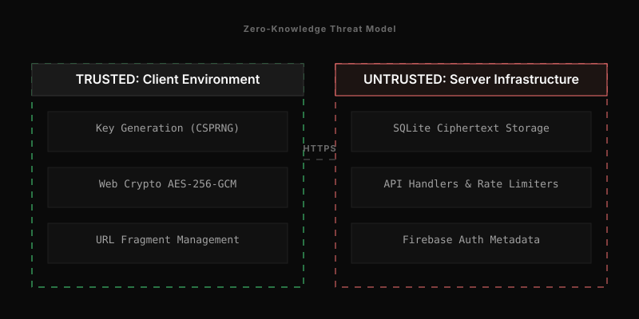

# Threat Model

  

This document outlines the security assumptions, assets, actors, and mitigations defining the Null-Secret architecture. It employs the STRIDE methodology (Spoofing, Tampering, Repudiation, Information Disclosure, Denial of Service, Elevation of Privilege) to evaluate risks.

## Assumptions and Boundaries

Null-Secret assumes the network, infrastructure, and backend storage are untrustworthy. 

**Trust Boundaries:**
- The client browser environment (trusted by the end-user).
- The network path between the browser and the backend API (untrusted).
- The Go API runtime (trusted to enforce limits, untrusted with plaintext).
- The SQLite persistence layer (untrusted).

## Assets

1. **Plaintext Secrets**: The unencrypted text and files users wish to share.
2. **Decryption Keys**: 256-bit AES-GCM keys generated in the browser.
3. **Admin Keys**: Tokens used by creators to delete their secrets early.
4. **Service Availability**: The ability of the Go API to process requests.

## Actors

- **Sender**: Creates secrets and holds the admin key.
- **Recipient**: Receives the sharing link containing the decryption key.
- **Eavesdropper**: Captures network traffic.
- **Infrastructure Attacker**: Gains access to the VPS, the SQLite database, or the API process.

## Threat Analysis

### 1. Information Disclosure

**Threat:** An attacker captures network traffic or compromises the SQLite database to read secrets.

**Mitigation:** 
- The browser encrypts all secrets before transmission. 
- The decryption key is encoded into the URL fragment (`#key`). Browsers strip URL fragments before sending HTTP requests, ensuring the key never traverses the network to the backend.
- The Go backend applies a second layer of AES-256-GCM encryption at rest using a `MASTER_KEY`. This protects the data if an attacker copies the SQLite file (`nullsecret.db`) from disk.
- The browser pads text payloads to fixed sizes (1024, 5120, or 10240 bytes) to obscure the length of the underlying plaintext, mitigating traffic analysis.

### 2. Tampering

**Threat:** An attacker alters the encrypted payload in transit or modifies the database records.

**Mitigation:** 
- The system exclusively uses AES-GCM, an Authenticated Encryption with Associated Data (AEAD) cipher.
- If an attacker alters the ciphertext or initialization vector (IV), the authentication tag validation fails. Both the Go backend and the React frontend reject modified payloads during the decryption phase and refuse to process the data.

### 3. Denial of Service

**Threat:** An attacker issues millions of requests to exhaust server CPU, memory, or disk space.

**Mitigation:** 
- `internal/api/handlers.go` enforces a global limit of 100 requests per second using a token bucket.
- A sliding window limits requests to 20 per minute per IP address. IPv6 addresses are truncated to a `/64` prefix to prevent evasion through suffix rotation.
- A Go channel semaphore restricts active concurrent requests to 100.
- `http.MaxBytesReader` caps incoming request bodies at 56MB.
- The SQLite database enforces a hard cap of 1,000 active secrets. Upon reaching the limit, the backend evicts the 10 oldest secrets before allowing new insertions.

### 4. Spoofing and Elevation of Privilege

**Threat:** An attacker guesses a secret ID to access data prematurely, or guesses an admin key to delete a secret they do not own.

**Mitigation:**
- Secret IDs and Admin Keys are generated using cryptographically secure random number generators (`crypto/rand`).
- The backend stores Admin Keys as SHA-256 hashes.
- When evaluating a DELETE request, the backend hashes the provided key and compares it to the database hash using `crypto/subtle.ConstantTimeCompare`. This prevents an attacker from measuring response times to guess the key byte-by-byte.

### 5. Repudiation

**Threat:** A sender denies sending a secret, or a recipient denies opening it.

**Mitigation:**
- Null-Secret does not mitigate repudiation. The application prioritizes anonymity over auditability. It does not track read receipts, IP logs, or identity markers in the database schema. When a view limit is reached, the backend deletes the record permanently.

## Residual Risk

The architecture cannot protect against compromise inside the trusted boundary.

- **Endpoint Compromise:** Malware, keyloggers, or malicious browser extensions on the sender or recipient devices can capture the plaintext.
- **Recipient Action:** The recipient can copy the plaintext or capture a screenshot before the data disappears from memory.
